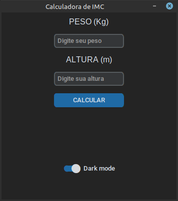

# BMI Calculator

A simple and modern Body Mass Index (BMI) calculator built with [CustomTkinter](https://github.com/TomSchimansky/CustomTkinter) for Python. This application allows users to quickly calculate their BMI and receive a classification based on the result.

## Features

- User-friendly graphical interface
- Supports dark and light mode
- Instant BMI calculation and classification
- Input validation with helpful error messages

## Screenshots



## Installation

1. **Clone the repository:**
   ```sh
   git clone https://github.com/luanaamag/BMI_Calculator
   cd bmi-calculator
   ```

2. **Create and activate a virtual environment (optional but recommended):**
   ```sh
   python -m venv .venv
   source .venv/bin/activate  # On Windows use: .venv\Scripts\activate
   ```

3. **Install the dependencies:**
   ```sh
   pip install -r requirements.txt
   ```

## Usage

Run the application with:

```sh
python BMI_Calculator.py
```

Enter your weight (kg) and height (m), then click "CALCULATE" to see your BMI and its classification.

## Dependencies

- [customtkinter](https://pypi.org/project/customtkinter/)
- [darkdetect](https://pypi.org/project/darkdetect/)
- [packaging](https://pypi.org/project/packaging/)

All dependencies are listed in [requirements.txt](requirements.txt).

## License

This project is licensed under the MIT License.

---

Made with ❤️ using Python and CustomTkinter.